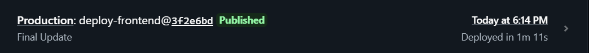
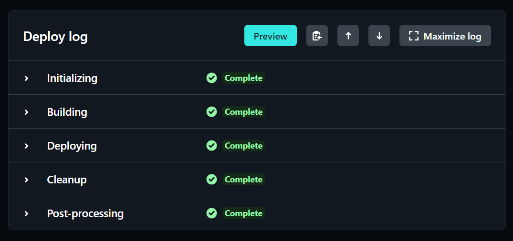
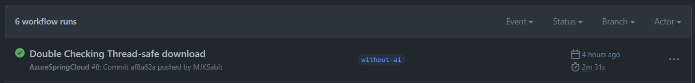
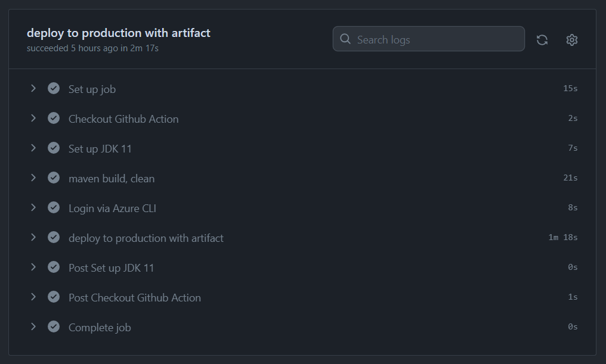
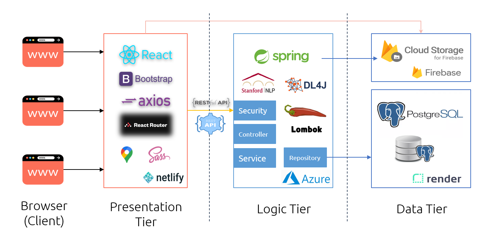
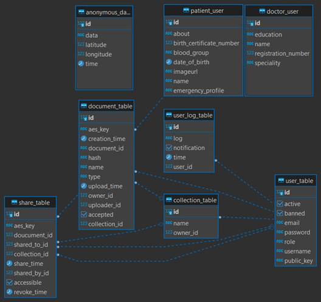

# Spondon

> Medical document store, verify and sharing platform with end-to-end encryption

[Youtube Presentaion](https://youtu.be/XDA4e3avoiA)

## Project Overview

- Encourages user to __store and share__ their medical records with __end-to-end encryption__

- __Verify__ a documents’ __authenticity and identify__ prescription/medical record __tempering__

- Identify __patient negligence / doctor mistreatment__ with share history

- __Doctor-Patient Confidentiality__, Patient has __full control__ over his data

- __Faster__ Medical document (eg. fitness certificate) **verification process**

- __Emergency__ medical information

- __Organize__ medical documents in __collection__, easily **share a group of documents**

- __Public health analysis__ for Directorate General of Health Services (DGHS)

## Tech Stack

### Frontend

- ReactJS

- React Bootsrap

- Axios

- React Router

- Google Map SDK

- SCSS

### Backend

- Spring Boot

- Spring Web

- Spring Security

- JPA Hibernate

- JWT Token

- Lombok

- Stanford Core NLP

- Deep Learing for Java (dl4j)

- Word2Vec Pretrained Model

### Persitance

- ProsgreSQL Database

- Firebase Cloud Storage

## Deployment and Automation

### Frontend

**Deplyment:** [Netlify](https://sp0nd0n.netlify.app/)

**CI/CD:** Trigger on `deply-frontend` branch





### Backend

> Backend was deplyed without NLP because the `deeplearning4j` and `Stanford Core NLP` take too much resources. Tokenization in the deployed version is done using regular expression and `Word2Vec` function similarity is rewritten by us in java.
>
> This version of code is in `without-ai` branch

**Deplyment:** [Azure](https://spondon-backend-7.azuremicroservices.io)

**Docker Image**: [URL]([Docker](https://hub.docker.com/repository/docker/mjksabit/spondon-backend) `docker push mjksabit/spondon-backend:without-nlp`

**CI/CD**: Trigger on `without-ai` branch





### Database

**Deployment**: Render

## Architecture & Data Flow

Three Tier Archirecture: Presentation Tier, Logic Tier, Data Tier



## External API

- __ImageBB__: To upload image

- __Endless Medical__: AI integrated symptom analyzer

- __ChatPDF__: Analyze pdf files and ask questions

## Entity Relationship Diagram



## End-to-end Encryption

- User have __RSA public-private key pair__, public key is  stored in the database

- When a document is uploaded, a __random password__ is generated, which is used for __AES encryption__ of the document

- The __generated key encrypted with user public key__ stored in the database for accessing the document later

- All these are done at frontend

## AI tools used

- __Endless Medical__: AI integrated symptom analyzer [[link](https://endlessmedical.com/)]

- __ChatPDF__: Analyze pdf files and ask questions [[link](https://www.chatpdf.com/)]

- __Analysis__: __Stanford CoreNLP__ with __deeplearing4j__ for *tokenizing*, sentence splitting, sentiment etc analysis of anonymous data using __word2vec__ pretrained model

## Project Structure

### Backend

```
Dockerfile

./java/com/github/mjksabit
└── spondon
    ├── SpondonBackendApplication.java
    ├── consts
    ├── controller
    │   └── All the controllers are here
    ├── model
    │   └── All the entities are here
    ├── repository
    │   └── All the repositories are here
    ├── security
    │   └── Security configuration and JWT Filter
    ├── service
    │   └── All the services
    └── util
resources
└── application.properties
```

### Frontend

```
public
└── PUBLIC folder required by React

src/app
├── App.js (Entry Point)
├── App.scss (SASS Root)
├── AppRoutes.js (React Router Entrypoint, Lazy loaded Components)
├── admin
│   └── Admin Related Components
├── api
│   └── All API calls
├── common
│   └── Common Components and security functions
├── doctor
│   └── Doctor Related Components
├── firebase-config.js
├── logo.svg
├── shared
├── user
│   └── Doctor Related Components
└── user-pages
    └── Auth Related Components
```

## Running the App

### Frontend

- Installing Dependency
  
  ```
  npm i
  ```

- Running frondend
  
  ```
  npm start
  ```

- Building frontend
  
  ```
  npm build
  ```

### Backend

- Running backend
  
  ```
  ./mvnw spring-boot:run
  ```

- Building backend
  
  ```
  ./mvnw clean package
  java -jar target/spondon-0.0.1-SNAPSHOT.jar
  ```

- Building & Running docker image
  
  ```
  docker build -t spondon-backend .
  docker run --env-file ./.env --expose=8080 -p 8080:8080 spondon-backend
  ```

- Environment Variable
  
  ```
  DB_PASSWORD=
  DB_URL=
  DB_USER=
  DEBUG_MODE=false
  GMAIL=
  GMAIL_SMTP_PASSWORD=
  JWT_SECRET=
  FRONTEND_URL=https://sp0nd0n.netlify.app
  ```
